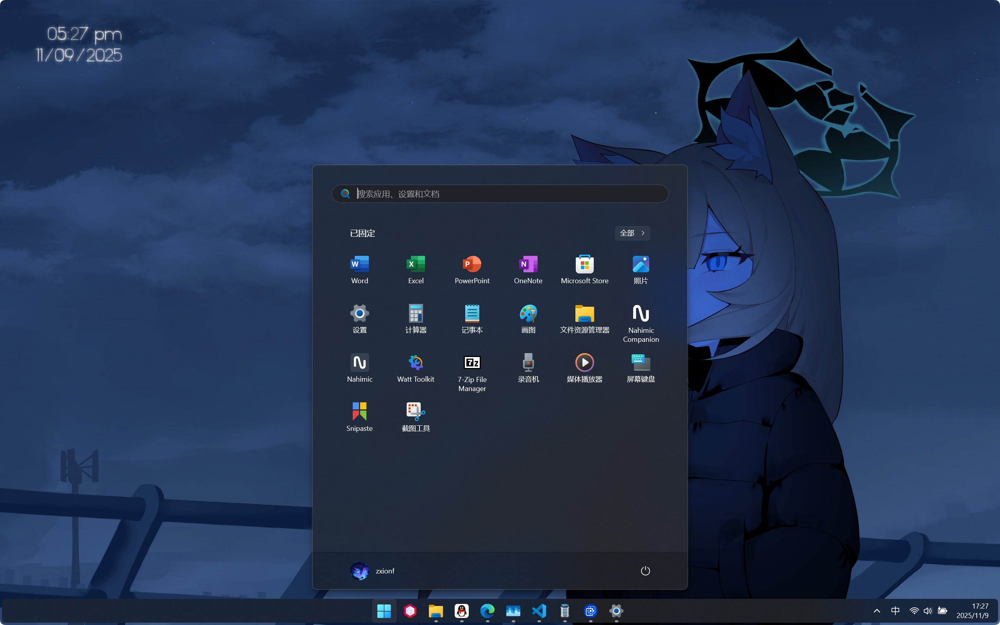
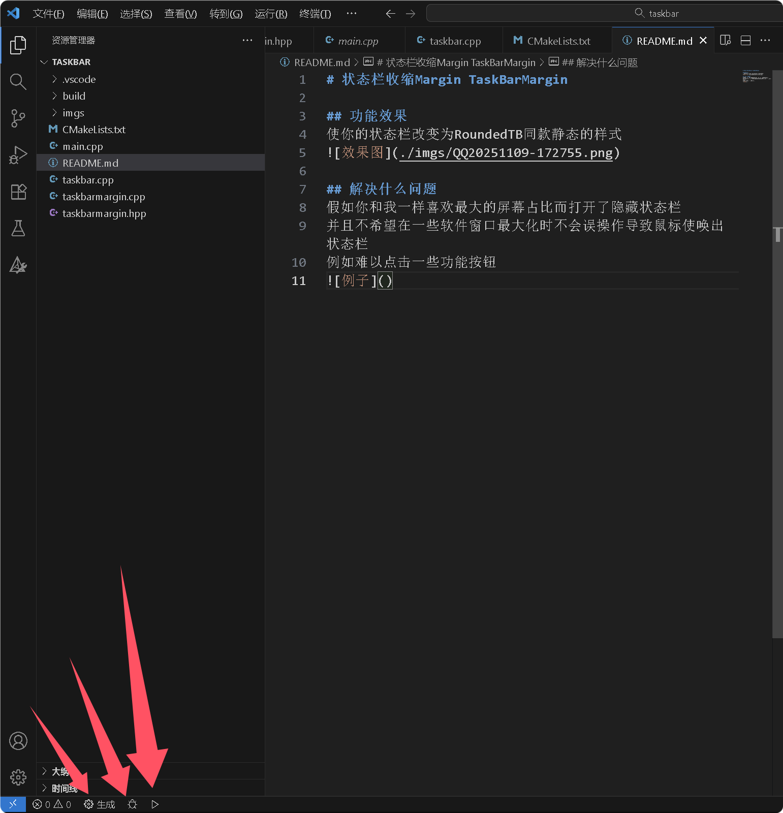

# 状态栏收缩Margin TaskBarMargin

## 功能效果
使你的状态栏改变为RoundedTB同款静态的样式  
鼠标到达屏幕下沿不会唤起状态栏


## 解决什么问题
假如你和我一样喜欢最大的屏幕占比而打开了隐藏状态栏
并且不希望在一些软件窗口最大化时不会误操作导致鼠标使唤出状态栏
例如难以点击一些功能按钮


## 原理
1. 找到状态栏对应的窗口
2. 重新给其分配`HRGN`

## 启用
- 直接双击运行
- 或者使用powershell
    ```powershell
    .\tb.exe
    ```
- 开机自启
资源管理器中输入`shell:startup`导航到启动文件夹
然后把程序的快捷方式放入其中

## 恢复
- 重启资源管理器
- powershell
    ```shell
    .\tb.exe -r
    ```

## 不足
- 没有适配多显示器
- 可能会在运行后失效
- 想要唤起状态栏需要按键盘Win键
- 大圆角时有明显的锯齿